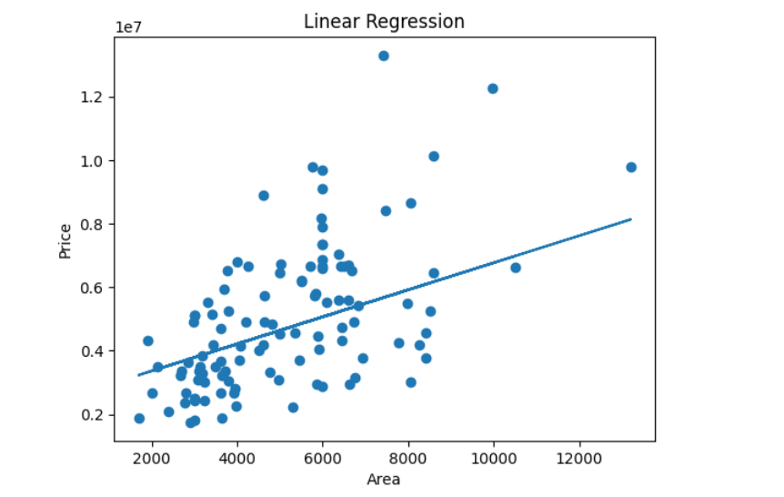
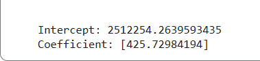
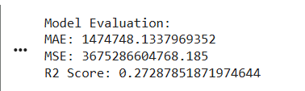

# 🏡 House Price Prediction using Linear Regression

## 📌 Project Overview

This project demonstrates the implementation of **Simple Linear Regression** to predict house prices based on property area. It helps in understanding how machine learning models can identify relationships between variables and make predictions.

---

## 🎯 Objective

* Build a Linear Regression model using Scikit-learn
* Analyze the relationship between **area and price**
* Evaluate model performance using different metrics

---

## 📊 Dataset

* Housing Dataset
* Feature: `area`
* Target: `price`

---

## ⚙️ Tools & Technologies

* Python
* Pandas
* NumPy
* Matplotlib
* Scikit-learn

---

## 🔄 Steps Performed

1. Imported dataset using Pandas
2. Checked dataset structure and columns
3. Selected features and target variables
4. Split dataset into training and testing sets
5. Applied Linear Regression model
6. Predicted values
7. Evaluated model using:

   * MAE
   * MSE
   * R² Score
8. Visualized results using graph
9. Interpreted model coefficients

---

## 📈 Model Performance

| Metric   | Value            |
| -------- | ---------------- |
| MAE      | 1474748.13       |
| MSE      | 3675286604768.18 |
| R² Score | 0.2728           |

---

## 🔍 Key Insights

* Positive relationship between area and price
* As area increases, price increases
* Model shows a linear trend in data
* Prediction accuracy is moderate

---

## 📷 Output Screenshots

### 📊 Regression Graph

### 📈 Model Output

### 📌 Final Result

---

## 🧠 Learnings

* Understood basics of Linear Regression
* Learned model evaluation techniques
* Improved data visualization skills
* Gained practical ML experience

---

## 🚀 Future Improvements

* Use Multiple Linear Regression
* Add more features (bedrooms, location, etc.)
* Apply feature scaling
* Try advanced ML models

---

## 👨‍💻 Author

**Priyansh Bhatt**

---

## ⭐ Conclusion

This project successfully demonstrates how Linear Regression can be used to predict real-world data. It builds a strong foundation for advanced machine learning concepts.
